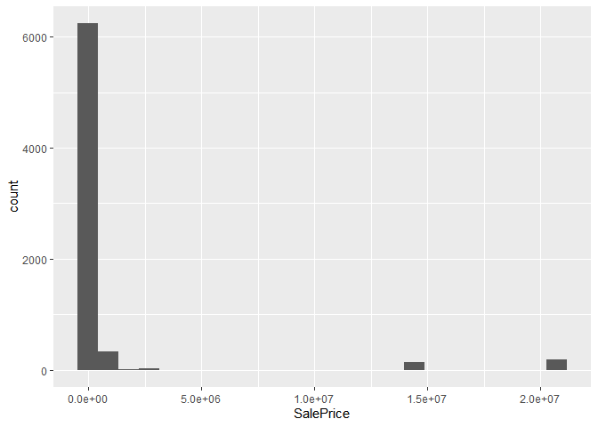

<!-- README.md is generated from README.Rmd. Please edit the README.Rmd file -->

# Lab report \#1

Follow the instructions posted at
<https://ds202-at-isu.github.io/labs.html> for the lab assignment. The
work is meant to be finished during the lab time, but you have time
until Monday evening to polish things.

Include your answers in this document (Rmd file). Make sure that it
knits properly (into the md file). Upload both the Rmd and the md file
to your repository.

All submissions to the github repo will be automatically uploaded for
grading once the due date is passed. Submit a link to your repository on
Canvas (only one submission per team) to signal to the instructors that
you are done with your submission.

## 1. Inspect the first few lines of the dataset

``` r
  library(classdata)
  head(ames)
```

    ##    Parcel ID                       Address             Style
    ## 1 0903202160      1024 RIDGEWOOD AVE, AMES 1 1/2 Story Frame
    ## 2 0907428215 4503 TWAIN CIR UNIT 105, AMES     1 Story Frame
    ## 3 0909428070        2030 MCCARTHY RD, AMES     1 Story Frame
    ## 4 0923203160         3404 EMERALD DR, AMES     1 Story Frame
    ## 5 0520440010       4507 EVEREST  AVE, AMES              <NA>
    ## 6 0907275030       4512 HEMINGWAY DR, AMES     2 Story Frame
    ##                        Occupancy  Sale Date Sale Price Multi Sale YearBuilt
    ## 1 Single-Family / Owner Occupied 2022-08-12     181900       <NA>      1940
    ## 2                    Condominium 2022-08-04     127100       <NA>      2006
    ## 3 Single-Family / Owner Occupied 2022-08-15          0       <NA>      1951
    ## 4                      Townhouse 2022-08-09     245000       <NA>      1997
    ## 5                           <NA> 2022-08-03     449664       <NA>        NA
    ## 6 Single-Family / Owner Occupied 2022-08-16     368000       <NA>      1996
    ##   Acres TotalLivingArea (sf) Bedrooms FinishedBsmtArea (sf) LotArea(sf)  AC
    ## 1 0.109                 1030        2                    NA        4740 Yes
    ## 2 0.027                  771        1                    NA        1181 Yes
    ## 3 0.321                 1456        3                  1261       14000 Yes
    ## 4 0.103                 1289        4                   890        4500 Yes
    ## 5 0.287                   NA       NA                    NA       12493  No
    ## 6 0.494                 2223        4                    NA       21533 Yes
    ##   FirePlace              Neighborhood
    ## 1       Yes       (28) Res: Brookside
    ## 2        No    (55) Res: Dakota Ridge
    ## 3        No        (32) Res: Crawford
    ## 4        No        (31) Res: Mitchell
    ## 5        No (19) Res: North Ridge Hei
    ## 6       Yes   (37) Res: College Creek

``` r
  summary(ames)
```

    ##   Parcel ID           Address                        Style     
    ##  Length:6935        Length:6935        1 Story Frame    :3732  
    ##  Class :character   Class :character   2 Story Frame    :1456  
    ##  Mode  :character   Mode  :character   1 1/2 Story Frame: 711  
    ##                                        Split Level Frame: 215  
    ##                                        Split Foyer Frame: 156  
    ##                                        (Other)          : 218  
    ##                                        NA's             : 447  
    ##                           Occupancy      Sale Date            Sale Price      
    ##  Condominium                   : 711   Min.   :2017-07-03   Min.   :       0  
    ##  Single-Family / Owner Occupied:4711   1st Qu.:2019-03-27   1st Qu.:       0  
    ##  Townhouse                     : 745   Median :2020-09-22   Median :  170900  
    ##  Two-Family Conversion         : 139   Mean   :2020-06-14   Mean   : 1017479  
    ##  Two-Family Duplex             : 182   3rd Qu.:2021-10-14   3rd Qu.:  280000  
    ##  NA's                          : 447   Max.   :2022-08-31   Max.   :20500000  
    ##                                                                               
    ##   Multi Sale          YearBuilt        Acres         TotalLivingArea (sf)
    ##  Length:6935        Min.   :   0   Min.   : 0.0000   Min.   :   0        
    ##  Class :character   1st Qu.:1956   1st Qu.: 0.1502   1st Qu.:1095        
    ##  Mode  :character   Median :1978   Median : 0.2200   Median :1460        
    ##                     Mean   :1976   Mean   : 0.2631   Mean   :1507        
    ##                     3rd Qu.:2002   3rd Qu.: 0.2770   3rd Qu.:1792        
    ##                     Max.   :2022   Max.   :12.0120   Max.   :6007        
    ##                     NA's   :447    NA's   :89        NA's   :447         
    ##     Bedrooms      FinishedBsmtArea (sf)  LotArea(sf)          AC           
    ##  Min.   : 0.000   Min.   :  10.0        Min.   :     0   Length:6935       
    ##  1st Qu.: 3.000   1st Qu.: 474.0        1st Qu.:  6553   Class :character  
    ##  Median : 3.000   Median : 727.0        Median :  9575   Mode  :character  
    ##  Mean   : 3.299   Mean   : 776.7        Mean   : 11466                     
    ##  3rd Qu.: 4.000   3rd Qu.:1011.0        3rd Qu.: 12088                     
    ##  Max.   :10.000   Max.   :6496.0        Max.   :523228                     
    ##  NA's   :447      NA's   :2682          NA's   :89                         
    ##   FirePlace                            Neighborhood 
    ##  Length:6935        (27) Res: N Ames         : 854  
    ##  Class :character   (37) Res: College Creek  : 652  
    ##  Mode  :character   (57) Res: Investor Owned : 474  
    ##                     (29) Res: Old Town       : 469  
    ##                     (34) Res: Edwards        : 444  
    ##                     (19) Res: North Ridge Hei: 420  
    ##                     (Other)                  :3622

``` r
  str(ames)
```

    ## Classes 'tbl_df', 'tbl' and 'data.frame':    6935 obs. of  16 variables:
    ##  $ Parcel ID            : chr  "0903202160" "0907428215" "0909428070" "0923203160" ...
    ##  $ Address              : chr  "1024 RIDGEWOOD AVE, AMES" "4503 TWAIN CIR UNIT 105, AMES" "2030 MCCARTHY RD, AMES" "3404 EMERALD DR, AMES" ...
    ##  $ Style                : Factor w/ 12 levels "1 1/2 Story Brick",..: 2 5 5 5 NA 9 5 5 5 5 ...
    ##  $ Occupancy            : Factor w/ 5 levels "Condominium",..: 2 1 2 3 NA 2 2 1 2 2 ...
    ##  $ Sale Date            : Date, format: "2022-08-12" "2022-08-04" ...
    ##  $ Sale Price           : num  181900 127100 0 245000 449664 ...
    ##  $ Multi Sale           : chr  NA NA NA NA ...
    ##  $ YearBuilt            : num  1940 2006 1951 1997 NA ...
    ##  $ Acres                : num  0.109 0.027 0.321 0.103 0.287 0.494 0.172 0.023 0.285 0.172 ...
    ##  $ TotalLivingArea (sf) : num  1030 771 1456 1289 NA ...
    ##  $ Bedrooms             : num  2 1 3 4 NA 4 5 1 3 4 ...
    ##  $ FinishedBsmtArea (sf): num  NA NA 1261 890 NA ...
    ##  $ LotArea(sf)          : num  4740 1181 14000 4500 12493 ...
    ##  $ AC                   : chr  "Yes" "Yes" "Yes" "Yes" ...
    ##  $ FirePlace            : chr  "Yes" "No" "No" "No" ...
    ##  $ Neighborhood         : Factor w/ 42 levels "(0) None","(13) Apts: Campus",..: 15 40 19 18 6 24 14 40 13 23 ...

### Step 1 Result

The dataset has the following variables of note:

Parcel ID

- This is a character based variable describing the ID of the
  transaction.
- This seems to be a 10 length character string of numbers.

Address

- This is a character based variable with the address of the place sold.
- This has a long range of strings for the address.

Style

- Factor based variable describing the style of home (1 story, 2 story,
  etc.)
- 12 possible values.

Occupancy

- Factor based variable describing how many people can live in the home.
  (Condominium, Single-Family, Townhouse, etc)
- 5 possible values.

Sale Date

- Date variable saying when the home was sold.
- Expected range between 2017-07-03 and 2022-08-31.

Sale Price

- Numerical variable describing the price of the home when sold.
- Expected range between 0 to 20500000.

Year Built

- Numerical variable with the year that the home was built.
- Expected range between 0 and 2022.

Acres

- Numerical variable describing the number of acres the house has with
  it.
- Expected value from 0.0 to maximum of 12.012.

TotalLivingArea

- Numerical variable describing the square feet of the living area of
  the home.
- Expected values ranging from 0 to maximum of 6007.

Bedrooms

- Numerical value describing the number of bedrooms in the home.
- Expected values ranging from 0.0 to 10.0.

FinishedBsmtArea

- Numerical value describing the square feet of the finished basement.
- Expected values ranging from 10.0 to 6496.0

LotArea

- This is a numerical variable describing the total square feet of the
  lot.
- The expected values range from 0 to a maximum of 523228.

AC - This is a character variable describing whether the home has AC or
not. - The expected value is either “Yes” or “No”

FirePlace - This is a character value describing whether the home has a
FirePlace or not. - The expected value is either “Yes” or “No”

Neighborhood - This is a factor variable describing the neighborhood of
the home being sold. - This has 42 different categories to describe the
different neighborhoods of ames.

## 2. Is there a variable of special interest or focus?

Yes there is a variable of special interest. The sale price is a
variable that we are told to look into more closely.

## 3. Start the exploration of the main variable:

``` r
library(ggplot2)
colnames(ames)[6] = "SalePrice"

ggplot(data = ames, aes(x = SalePrice)) + geom_histogram(binwidth=900000)
```

<!-- -->

## 4. Start Exploration of Main Vairable.

### Cassidy’s Work

I am going to explore the TotalLivingArea variable.
